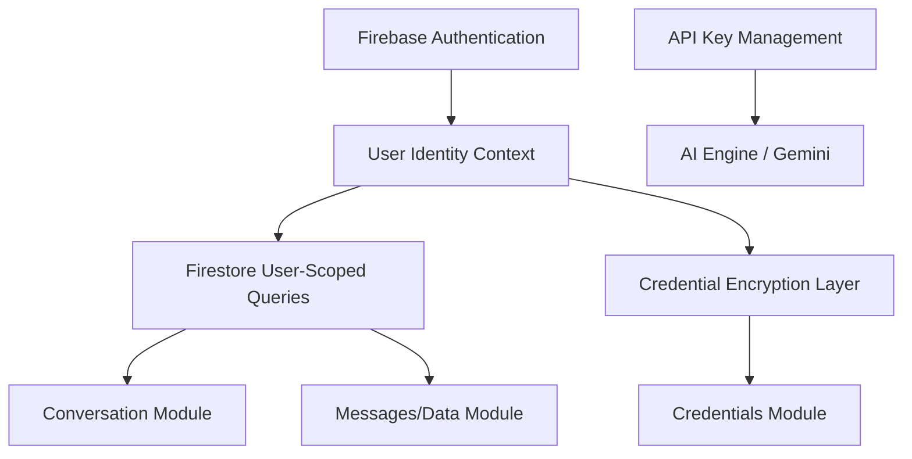

# Dependency Graph: DataBot

## Core Dependencies
1. **Auth** is the foundation for everything. Without it, data isolation and encryption are impossible to implement correctly.
2. **User Identity** flows into every database operation.
3. **Encryption** depends on a secure user key (derived from auth).

---
*Created during Dependency Graph phase.*
